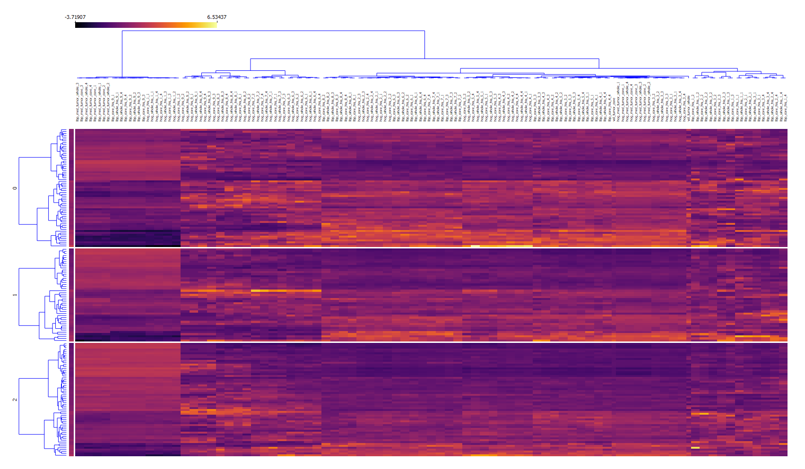

# IA368X_Diedre_Joany_Leard

# Survival Prediction of Patients with Brain Tumor
# Predição de Sobrevivência em Pacientes com Tumor Cerebral

## Descrição Resumida do Projeto
O desafio Brain Tumor Segmentation Challenge (BraTS) contribui diretamente na provisão de dados públicos de ressonância magnética para pesquisa sobre tumores cerebrais, com diversas tarefas envolta da segmentação dos tumores. Uma destas, é a utilização de segmentações para estudar a possibilidade de predição de sobrevivência dos pacientes. O diagnóstico de Tumor Cerebral frequentemente acompanha uma previsão de tempo de vida do paciente, onde a acurácia desta previsão pelo médico pode melhorar a qualidade de vida antes do óbito, também chamada de qualidade de morte. Este trabalho pretende experimentar com os dados públicos do BraTS, com objetivo de prever com menor erro possível o tempo de sobrevivência dos pacientes, utilizando-se das segmentações manuais providas. Comparamos modelos de aprendizado de máquina tradicionais e baseados em Aprendizado Profundo. Os dados incluem anotações da idade e do tempo que o paciente sobreviveu, que são usados como referência. Os melhores resultados encontrados foram de ?.

## Abstract in English
The Brain Tumor Segmentation Challenge (BraTS) challenge directly contributes to the provision of public MRI data for brain tumor research, with several tasks surrounding the main task of tumor segmentation. One of these tasks is the use of segmentations to study the possibility of predicting patient survival. The diagnosis of Cerebral Tumor often accompanies a prediction of the patient's lifetime, where the accuracy of this prediction by the physician can improve the quality of life before death, also called quality of death. This work intends to experiment with the public data of BraTS, in order to predict the survival time of patients with the least possible error, using the manual segmentations provided. We compare traditional machine learning models based on Deep Learning. The data includes notes on patient's age survival in days, which is used as a reference. The best results found were from ?.

## Equipe
Diedre Santos do Carmo - 211492

Joany do Socorro Santa Rosa Rodrigues - 264440

Leard de Oliveira Fernandes - 98413

## Vídeo do Projeto
[Vídeo Proposta Inicial](https://drive.google.com/file/d/1-9-7oIXs2XLczSTYfaEmQVObxV8At7mw/view?usp=sharing)

## Introdução e Motivação
Os tumores têm uma forma muito heterogênea, com diferentes graus e classificações associados. Devido a essa variação, o processamento automático de tumores cerebrais ainda é um desafio, seja para classificação, segmentação ou a tarefa específica deste trabalho, predição de sobrevivência.

O Brain Tumor Segmentation Challenge (BraTS)(citação) é um desafio anual que provê dados públicos multimodalidade (FLAIR, T1, T1 com contraste e T2) com anotações manuais de segmentação dos Glioma, um tipo de tumor cerebral. Também estão presentes tabelas de dias de sobrevivência dos pacientes dos quais as imagens foram adquiridas. A tarefa principal do BraTS é a de segmentação de tumores, usando segmentações manuais como referências. Outra das tarefas propostas pelo desafio envolve utilizar-se das segmentações para prever o tempo de sobrevivência do paciente.

A proposta deste projeto é avaliar a performance de métodos de aprendizado de máquina sobre a tarefa de predição de sobrevivência, utilizando-se como entrada tanto das imagens de MRI como de anotações manuais do tumor, alem da idade do paciente. Com consciência de que estes métodos não substituiriam o profissional da saúde, mas podem servir de um auxílio na decisão média, exploramos dois caminhos metodológicos: aprendizado de maquina tradicional com baseando-se em features como LBP, HOG e volume do tumor, e aprendizado profundo utilizando redes neurais convolucionais (CNN) 3D, com mecanismos de atenção. Uma hipótese paralela a ser explorada no futuro é que mapas de atenção resultantes da aplicação de uma CNN de predição de sobrevivência podem ser uma feature útil para segmentação automática.

## Perguntas de Pesquisa
É possível predizer automaticamente o tempo de sobrevivência de um paciente com Glioma com métodos de aprendizado de máquina? Qual a diferença de performance entre aprendizado de máquina tradicional e profundo?

## Objetivos do projeto
Utilizar aprendizado de máquina tradicional e aprendizado de máquina profundo na tentativa de predizer tempo de sobrevivência de pacientes com Glioma a partir dos dados de ressonância magnética e anotações manuais de tumores do BraTS 2020.

||
| :----------------------------------------------------------: |
|**Figura 1**: Visualização dos dados do BraTS de um sujeito. Estes dados serão entradas aos métodos propostos. As quatro modalidades são apresentadas, em ordem: FLAIR, T1, T1 com Contraste e T2. Também são exibidas na linha de baixo anotações manuais, em ordem: fundo, edema (DE), *non-enhancing tumor* (NET) e *enhancing tumor* (ET)|

## Recursos e Materiais

O conjunto de dados utilizado, do desafio BraTS 2020, contém 369 sujeitos com exames de ressonância magnética de quatro modalidades: T1, pós-contraste T1, T2 e volumes FLAIR (veja a Figura 1). Todos os exames são de gliomas de baixo ou alto grau (LGG / HGG), adquiridos com diferentes protocolos clínicos e vários scanners de várias instituições. Todos os sujeitos têm segmentações manuais, realizadas por um a quatro avaliadores, seguindo o mesmo protocolo, com a segmentação resultante sendo aprovada por profissionais experientes. neurorradiologistas. As anotações compreendem o *enhancing tumor* (ET), o edema peritumoral (ED) e o núcleo tumoral necrótico e *non enhancing tumor* (NET), conforme descrito no último artigo de resumo do BraTS (CITAÇÃO).  Os dados fornecidos são distribuídos após o pré-processamento do BraTS: co-registro para o mesmo modelo anatômico, interpolação para a mesma resolução e remoção do crânio. Pré-processamento adicional segue o aplicado no trabalho do Isensee (CITAÇÃO): as imagens são subtraídas pela média e divididas pelo desvio padrão da região do cérebro e cortadas dentro do intervalo de -5 a 5. Por fim, elas são min-max normalizadas até o intervalo de 0 a 1. As anotações são organizados de maneira exclusiva, incluindo plano de fundo, resultando em quatro canais (plano de fundo, ED, NET e ET). Informações de idade e sobrevivência, o alvo desta pesquisa, também são incluídas.

Este artigo dividirá os dados de treinamento do desafio (depois de randomizar com semente fixa) em uma abordagem de *hold-out* de 70% de treinamento, 10% de validação e 20% para o treinamento. Sujeitos que não tem informação de sobrevivência foram removidos, resultando em 169 treinamentos, 21 em validação e 46 sujeitos de teste de um total de 236 sujeitos com informação de sobrevivência. Todos esses sujeitos tem Glioma do tipo HGG.

## Ferramentas e Bibliotecas
A tabela abaixo contêm ferramentas e bibliotecas utilizadas na implementação deste trabalho.

| Ferramenta	| URL| 	Descrição|
| --- | --- | --- |
| Python 3| 	https://www.python.org/|	Linguagem de programação principal do projeto.|
| Orange | https://orange.biolab.si/ | Ferramenta gráfica para preparação de experimentos de visualização e aprendizado de máquina, baseada em Python. |
|Google Colab|	https://colab.research.google.com|	Plataforma online para execução de notebooks estilo Jupyter, provendo GPU gratuita (tempo de uso limitado).|

| Biblioteca | URL | Descrição |
| --- | --- | --- |
| Numpy | https://numpy.org/ | A base da maioria do processamento numérico em Python. |
| Pandas | https://pandas.pydata.org/ | Oferece vários métodos para lidar com tabelas. |
| Scikit-Learn | https://scikit-learn.org/stable/index.html | Implementações de diveros módulos para aplicações de Aprendizado de Máquina. |
| MatPlotLib | https://matplotlib.org/| Biblioteca de visualização.|
| NiBabel | https://nipy.org/nibabel/ | Provê métodos prontos para leitura e criação de imagens Nift, formato muito utilizado em trabalhos com imagens médicas. |
| MLflow  | https://mlflow.org/ | Ferramenta para gerenciamento de workflow de trabalhos de Aprendizado de Máquina, usada aqui principalmente para logging. |
| PyTorch | https://pytorch.org/ | Abstração de métodos para criação e avaliação de modelos de Aprendizado Profundo, usando operações em hardware (GPU). |
| Pytorch Lightning | https://pytorch-lightning.readthedocs.io/en/latest/| Maior abstração sobre o PyTorch e provisão de templates para tarefas comuns de pesquisa em Aprendizado Profundo. |

The used environment is the environment provided by Google Colaboratory. Note that some specially long CNN trainings had to be done in local GPUs, and unfortunately may not be reproducible in Colab due to time limitations. The only difference in local GPU usage was connecting Colab to a local Jupyter Kernel.

## Metodologia

Esta seção contêm explanações dos dois principais caminhos metodológicos seguidos por esse trabalho: utilização de aprendizado de máquina tradicional e aprendizado profundo.

Seguindo o padrão de avaliação do BraTS, a variável alvo de sobrevivência, em dias, é transformada em categórica para extração de métricas de classificação como acurácia. A conversão segue a Tabela abaixo:

| Classe           | Sobrevivência         |
| ---              | ---                   |
| Short-survivor   |  < 300 dias           |
| Mid-survivor     |>= 300 dias < 450 dias |
| Long-survivor    |     >= 450 dias       |

No método baseado em CNN, também é avaliada o MSE (*mean squared error* ou erro quadrático médio) comparado diretamente os valores de sobrevivência preditos com a anotação. No método tradicional, a otimização é realizada diretamente sobre as categorias.

### Aprendizado de Máquina Tradicional
Para a realização do processo de classificação de sobrevivência do sujeito, foram utilizados a idade e os descritores da imagem tumoral a partir de uma base de dados de 236 sujeitos. Para avaliação, validação e teste o conjunto disponibilizado foi dividido em 169 sujeitos para treino, 21 sujeitos para validação e 46 sujeitos para teste. As bases de treino e validação foram utilizadas para seleção dos melhores parâmetros e modelos utilizados no processo de classificação das imagens. As imagens disponibilizadas foram processadas no Colab utilizando a linguagem Python e o conjunto de bibliotecas Scikit-Learn, Numpy e Pandas para extração das características (descritores) da imagem. Além disso, foi utilizado o Orange para realizar a visualização das características obtidas.

Para a extração dos descritores foram consideradas as seguintes características: volume do tumor, média do histograma de vetores orientados (HOG), média do histograma do padrão binário local (LBP), 10 bins do histograma HOG e 10 bins do histograma LBP. Para todas as características de imagem, foram analisados o corpo sólido e o corpo necrosado do tumor (menor em volume), além disso foram considerados os 4 tipos de imagens disponibilizadas (T1, T1Gd, T2 e T2-FLAIR). Assim, foi possível totalizar 162 características da imagem para composição da classificação.

Para aplicação dos modelos de classificação os dados obtidos foram normalizados (média 0, desvio padrão 1). Foram considerados os seguintes modelos: *Support Vector Machine*, *Passive Agressive Classifier*, *Random Forest* e *Logistic Regression*. Para todos os modelos utilizados foi empregada a técnica de *grid-search* para obtenção dos melhores parâmetros com os dados de treino e validação. Todos os modelos obtidos foram avaliados sobre os conjuntos de características das imagens de teste sem qualquer modificação de seus parâmetros (apenas no treino/validação), onde foram analisados precisão, revocação (*recall*), f1-score e acurácia.

#### Extração dos descritores de imagem

Para a extração do descritor HOG, optou-se pela aplicação apenas no tumor segmentado, uma vez que a resolução necessária para evidenciar o HOG numa imagem completa (cérebro e tumor) requer uma maior resolução ([Figura 1](./assets/img/image_hog_1.png) e [Figura 2](./assets/img/tumor_hog_1.png)).

|       |
| :----------------------------------------------------------: |
| **Figura 1:** Imagem do cérebro segmentado com tumor e histograma de gradientes orientados |
|       |
| **Figura 2:** Tumor segmentado e  seu histograma de gradientes orientados. |

Seguindo a mesma abordagem do descritor HOG, optou-se por extrair o descritor LBP apenas do tumor segmentado, conforme [Figura 3](./assets/img/tumo_lbp_1.png). Além disso, avaliou-se a aplicação do método PCA (*Principal Component Analisys*) para redução de dimensionalidade, mantendo a representatividade ao nível de 99%, contudo houve uma grande distorção no resultado, sendo então descartado a sua utilização [Figura 4](./assets/img/image_lbp_2.png).

|         |
| :----------------------------------------------------------: |
| **Figura 3:** Tumor segmentado e apresentação do descrito LBP. |
|                  |
| **Figura 4:** Tumor segmentado e apresentação do descritor LBP com utilização de PCA. |

#### Conjunto de características

A partir dos descritores de imagem processados e dos dados de idade do sujeito, foram gerados três arquivos CSV para cada treino, validação e teste. Cada arquivo foi gerado com diferentes resoluções para obtenção do descritor, da menor resolução para maior resolução, conforme tabela abaixo.

| Conjunto de Características | Pixels por célula (HOG) | Raio (LBP) | Número de Pontos (LBP) | Tempo    |
| :-------------------------: | :---------------------: | :--------: | :--------------------: | -------- |
|              0              |          (8,8)          |     3      |           8            | 02:00:00 |
|              1              |          (8,8)          |     3      |           9            | 02:10:00 |
|              2              |          (4,4)          |     3      |           12           | 04:30:00 |

### Aprendizado Profundo

Modelos de aprendizado profundo, especificamente redes neurais convolucionais (CNNs) contêm uma quantidade significativamente maior de parâmetros que o contido em redes neurais tradicionais. A rede tem capacidade de aprender diretamente dos dados, como dados de imagem, não somente de duas dimensões até de três dimensões. Em um breve resumo, um processo de otimização utilizando gradientes de uma função de perda que quantifica a performance da rede, atualiza todos os pesos das convoluções realizadas pela rede, que são seguidas de operações não lineares.

 **TODO**
*Figura (?): Diagrama da arquitetura da CNN3DAtt.*

A arquitetura da rede utilizada aqui, chamada de CNNAtt3D, é inspirada em uma CNN baseada em mecanismo de atenção (CITAÇÃO), de onde ela foi adaptada para convoluções 3D, onde a original é 2D. O número de canais, naturalmente diferente ao transformar de 2D para 3D, foi determinado por experimentos iniciais. A rede produz de forma não supervisionadas mapeamentos posicionais chamados de mapas de atenção, utilizando-se da função de ativação Sigmoid, que funcionam como um mapa de calor e um "portão" que deixa passar somente as *features* convolucionais desejadas pela otimização, naquela posição. Em resumo a arquitetura realiza camadas convolucionais seguidas de operações não-lineares, três camadas de atenção convergem em camadas totalmente conectadas. A conversão de *features* 3D para *features* 1D é realizada com *Global Average Pooling*, resultando em um valor de média por canal na saída do módulo de atenção. O valor de idade é adicionado nesta fase como um neurônio extra. A saída final consiste de um único neurônio. Este neurônio de saída é utilizado como ativação diretamente de dias de sobrevivência. A ativação deste neurônio é limitada entre 1 e 2000, utilizando-se de uma ativação Sigmoid. O intervalo foi escolhido baseando-se no intervalo observado nos *datasets* de treino e validação.

Especificamente para o experimento com a CNN3DAtt, as quatro anotações foram transformadas em três anotações cumulativas para economia de memória, seguindo a tabela abaixo:

| Nova anotação    | Composta de       |
| ---              | ---                   |
| Whole Tumor    |  ED + NET + ET           |
| Tumor Core     |  NET + ET |
| ET  |  ET      |

Tanto as imagens de MRI quanto as anotações do tumor são inseridas em conjunto, fundidas com uso de múltiplos canais. Quatro modalidades de MRI mais três canais da nova anotação resultam em sete canais de entrada. Data *augmentation* (aumentação de dados) foi utilizado na forma de patches aleatórios 7x128x128x128 em tempo de treinamento, e variação aleatória de intensidade de 0.1. Em tempo de predição (validação ou teste), *crops* centrais 7x128x128x128 são utilizados. A função de perda escolhida foi a Smooth L1 Loss (citação), onde uma perda de erro absoluto linear (L1) é realizada enquanto o valor é maior que 1.0, e MSE é utilizada em valores menor que 1.0. Devido aos altos valores de sobrevivência em dias, efetivamente a perda se torna L1 *Loss*. Valores de *loss* na casa das centenas são esperados, devido a não realizarmos nenhuma normalização neste caso. Experimentos iniciais determinaram um número de épocas de 300. *Weight Decay* é usado no otimizador com valor de 1e-05. *Batch size* é fixado no máximo cabendo em uma GPU de 12 GB de memória, 3. Experimentos com treinamento sobre *mixed-precision* pioraram o resultado.

Os experimentos principais apresentados aqui envolveram experimentar com *learning rate* e otimizador, entre Adam e RAdam. O melhor conjunto de hiperparâmetros de treinamento e validação foi escolhido para ser avaliado no conjunto de testes. Diversos experimentos realizados que não chegaram à convergência ou não tiveram impacto significativo, não serão apresentados. Finalmente, os mapas de atenção são visualizados para verificar em quais localizações aproximadas a rede esta dando mais "atenção".

## Detalhamento do Projeto

A seguir, links que levam as implementações da metodologia reportada neste relatório. Os notebooks são pontos de entrada para importação de outros códigos vindo de outras bibliotecas ou scripts presentes no Drive Compartilhado.

**[Notebook extração de features Notebook](./notebooks/Process_and_Extract_Features_MRI.ipynb)**, **[Notebook extração de features COLAB](https://colab.research.google.com/drive/1eS07y4vrmxqOWbt83kgCcXXXQKsvF2MI?usp=sharing)**

**[Notebook CNN](https://colab.research.google.com/drive/1IY-CMSZV-zriZP7jOq61AmR4f66XeqtI?usp=sharing)**

## Evolução do Projeto
O processamento correto dos dados acumulou boa parte do desenvolvimento desse projeto, devido ao peso e complexidade de lidar com dados de quatro dimensões. Erros no processamento fizeram alguns experimentos iniciais serem perdidos. Especial atenção foi prestada a partir desses erros para que a divisão e processamento estivessem corretos, notando que o processamento de centenas de volumes tri-dimensionais também requer alto poder computacional.

Um fator limitante para a escolha do modelo de classificação empregado na análise dos descritores de imagem foi relacionado ao tamanho amostral dos dados, uma vez que esses estavam limitados ao conjunto disponibilizado pelo desafio BraTS. Dessa forma, optou-se por utilizar diferentes modelos e, após treinamento e validação, realizar a avaliação dos dados de testes em todos os modelos. Além disso, procurou-se verificar diferentes conjuntos de dados em função da resolução de processamento dos descritores. Em função da limitação de Hardware e tempo de processamento, os dois principais descritores (HOG e LBP) apresentados na literatura foram utilizados.

Em termos da aproximação baseada em aprendizado profundo, a maior limitação da realização de experimentos adicionais de hiperparâmetros envolveram a demora em encontrar um ajuste de parâmetros que convergisse. O problema aparenta ser de difícil conversão, especialmente pela decisão de treinar diretamente sobre o valor de sobrevivência em dias. Provavelmente com algum tipo de normalização da saída a convergência seria mais fácil, o que é planejado para trabalhos futuros relacionados.

## Resultados e Discussão

Resultados e discussão das duas abordagens são apresentados separadamente nas próximas seções.

### Resultados dos modelos de classificação baseados em descritores de imagem

Todos os parâmetros escolhidos nos modelos avaliados passaram por validação cruzada (*20-fold cross validation*) e, ao final dos treinamentos, os mesmos foram avaliados nos três conjuntos de teste para as três classes de sobrevivência (curta, média e longa). A melhor acurácia foi obtida no modelo PAC (Classificador passivo agressivo), alcançando 59% de acurácia no conjunto de características com menor resolução dos descritores de imagem obtidos.

| Modelo    | Acurácia conjunto de características 0                       | Acurácia conjunto de características 1                       | Acurácia conjunto de características 2                       |
| :-------- | :----------------------------------------------------------- | ------------------------------------------------------------ | ------------------------------------------------------------ |
| **SVM**   | *Treino*: 0,93  *Validação*: 0,57 *Teste*: 0,41    | *Treino*: 0,93  *Validação*: 0,43 *Teste*: **0,49\**** | *Treino*: 0,55  *Validação*: 0,52 *Teste*: 0,39    |
| **nuSVM** | *Treino*: 0,91  *Validação*: 0,52  *Teste*: 0,43   | *Treino*: 0,90  *Validação*: 0,38 *Teste*: 0,46    | *Treino*: 0,91  *Validação*: 0,57 *Teste*: 0,33    |
| **PAC**   | *Treino*: 0,67  *Validação*: 0,38 *Teste*: **0,59** | *Treino*: 0,63  *Validação*: 0,52 *Teste*: **0,54** | *Treino*: 0,63  *Validação*: 0,43 *Teste*: 0,33    |
| **RF**    | *Treino*: 1,00  *Validação*: 0,43 *Teste*: 0,37    | *Treino*: 1,00  *Validação*: 0,48 *Teste*: 0,39    | *Treino*: 1,00  *Validação*: 0,48 *Teste*: **0,41*** |
| **LF**    | *Treino*: 0,74  *Validação*: 0,43 *Teste*: **0,47*** | *Treino*: 0,72  *Validação*: 0,43 *Teste*: **0,50*** | *Treino*: 0,69  *Validação*: 0,57 *Teste*: **0,43** |

Contudo, é necessário avaliar a limitação do tamanho da base de dados e da distribuição de classes de sobrevivência. O que poderia explicar o baixo desempenho do modelo SVM na validação e teste, além de um possível *overfit* (apesar da validação cruzada durante o treinamento). Apesar do uso limitado de descritores de imagem (volume, HOG e LBP), o número de características é próximo ao tamanho do conjunto de dados, o que torna difícil sua análise quanto a robustez  (o que é significante no conjunto de treino, pode não ser na validação e testes).

Abaixo temos um mapa de calor dos descritores de imagem obtidos em que é possível verificar agrupamentos entre diferentes descritores em imagens distintas. Assim, acredita-se que estas características (*features*) poderiam ser agregadas para reduzir a dimensionalidade dos dados avaliados.

|  |
| :----------------------------------------------------: |
|    Figura X: Mapa de calor dos descritores obtidos.    |

### Resultados Aprendizado Profundo

A tabela abaixo apresenta experimento de hiperparâmetros sobre a CNN3DAtt selecionados. Valores de *Loss* menores são melhores. Lembre-se que esse valor exprime essencialmente a média do erro entre a predição de sobrevivência em dias e a sobrevivência real. O tempo médio de execução de um experimento foi em média 24 horas.

|ID | Otimizador | Learning Rate | Melhor Loss Validação (L1) |
|---| ---        | ---           | ---                   |
| 1 |    Adam    |   1e-04       |      285              |
| 2 |    RAdam   |   1e-04       |      244              |
| 3 |    RAdam   |   5e-05       |      **227**          |
| 4 |    RAdam   |   1e-05       |      260              |

Os gráficos abaixo apresentam comparações da convergência e grau de *overfit* da CNN3DAtt para os modelos 1 a 5.

|         |
| :----------------------------------------------------------: |
| **Figura X:** Convergência da Loss para treino e validação dos modelos 1 a 5. Linhas pontilhadas são curvas de treino, e contínuas de validação. Observa-se o mínimo de validação do melhor modelo, 3, em vermelho.|

O modelo 3, com resultados em negrito, foi selecionado como melhor modelo para avaliação mais aprofundada e resultados de teste, incluindo avaliação de acurácia (ACC) de classificação sobre as 3 classes definidas previamente, e erro médio quadrático, presentes na tabela abaixo.

| Dataset   | MSE | ACC  |
| ---       | ---   |  --- |
| Validação |118352 | 0.66 |
| Teste     |129667 | 0.54 |

Embora os resultados não aparentem ser bons inicialmente, é importante notar que o desempenho de validação alcançado por métodos submetidos ao último desafio de 2019 variou entre 0.2 e 0.65, com MSE entre 80000 e 3000000 ou mais. Os valores não são diretamente comparáveis devido a dois fatores: os conjuntos de dados são diferentes; e o BraTS requer que a os autores utilizem suas próprias segmentações como entrada da predição de sobrevivência, o que não foi feito neste trabalho. Utilizamos-nos das anotações manuais, o que pode ter trazido uma vantagem. Devido a esses fatores, não faremos comparações diretas com outros métodos da literatura.

A Figura X visualiza o mapa de atenção da CNN3DAtt como uma imagem devido a sua propriedade de possuir um canal ativado entre 1 e 0, como descrito na metodologia. Valores de cor foram adicionados para melhor visualização utilizando o *colormap* "afmhot" do matplotlib, e somente valores entre 0.8 e 1.0 são incluídos para maior contraste.

|         |
| :----------------------------------------------------------: |
| **Figura X:** Visualização do primeiro mapa de atenção comparada à fatias das quatro modalidades correspondentes.|

Note como as ativações maiores do mapa de atenção estão coincidindo com a área do tumor, mostrando que a rede está levando em maior consideração *features* convolucionais aprendidas próximas a essa área.

## Conclusões

Apresentou-se um estudo da aplicação de técnicas tradicionais e de aprendizado profundo sobre os dados de treino do BraTS 2020 para previsão de sobrevivência, dividido em conjuntos de treino, validação e teste. Mostrou-se que é possível alcançar predições de sobrevivência com erro absoluto médio de aproximadamente 200 dias, com acurácia em níveis similares ao reportado por submissões passadas ao desafio. Como trabalho futuro, precisa-se testar resultados nos dados de validação e teste do BraTS 2020, que ainda estão por ser liberados.

## Referências

BREIMAN, Leo. Random forests. **Machine learning**, v. 45, n. 1, p. 5-32, 2001.

CHANG, Chih-Chung; LIN, Chih-Jen. LIBSVM: A library for support vector machines. **ACM transactions on intelligent systems and technology (TIST)**, v. 2, n. 3, p. 1-27, 2011.

CRAMMER, Koby et al. Online passive-aggressive algorithms. **Journal of Machine Learning Research**, v. 7, n. Mar, p. 551-585, 2006.

FAN, Rong-En et al. LIBLINEAR: A library for large linear classification. **Journal of machine learning research**, v. 9, n. Aug, p. 1871-1874, 2008.

TODO referências CNN
